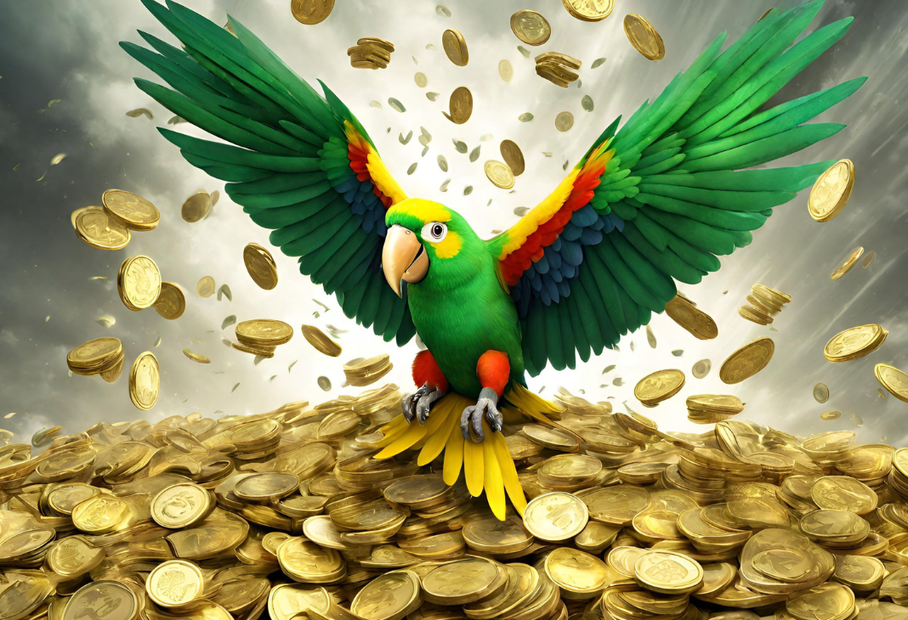

<h1> Golden Parrot</h1>
 <a href="https://fulgenciodiaz.github.io/GAMEGoldenParrot/">
      <h1> Play GOLDEN PARROT</h1>
</a>

 </img>

&#128154
Golden Parrot es un proyecto académico cuyo primer sprint duró dos semanas.
El proyecto consiste en un juego de plataformas en el que el jugador debe
recoger monedas, atacar enemigos o evitarlos y entregar las monedas en la parte inferior en la que le espera el barco, todo ello para conseguir la mayor puntuación posible.
El juego está desarrollado en JavaScript y HTML5 Canvas.

En los próximo sprint se busca:

<ol>
<li> Mejorar las colisiones &#128170</li>
 <li>Añadir lógica de niveles &#128170</li>
<li> Repensar la entrega de monedas al barco que las recibe &#129299</li>
<li> Mejorar la documentación &#129299</li>
</ol>

El juego está disponible en:
<a href="https://fulgenciodiaz.github.io/GAMEGoldenParrot/">
https://fulgenciodiaz.github.io/GAMEGoldenParrot/
</a>
   

   

El repositorio está disponible en: <a href="https://github.com/FulgencioDiaz/GAMEGoldenParrot">https://github.com/FulgencioDiaz/GAMEGoldenParrot </a>

   

Desarrollado por Fulgencio Díaz: <a href="https://www.linkedin.com/in/fulgencio-d%C3%ADaz-puga/">(Linkedin Profile)  </a>

----------------------------------English---------------------------------

&#128154
Golden Parrot is an academic project whose first sprint lasted two weeks.
The project consists of a platform game in which the player must collect coins, attack enemies or avoid them, and deliver the coins to the bottom where the ship awaits, all to achieve the highest possible score.
The game is developed in JavaScript and HTML5 Canvas.

In the next sprint, we aim to:

<ol>
<li> Improve collisions &#128170</li>
 <li>Add level logic &#128170</li>
<li> Rethink the delivery of coins to the receiving ship &#129299</li>
<li> Improve documentation &#129299</li>
</ol>

The game is available at:
<a href="https://fulgenciodiaz.github.io/GAMEGoldenParrot/">
https://fulgenciodiaz.github.io/GAMEGoldenParrot/
</a>
  

  

The repository is available at: <a href="https://github.com/FulgencioDiaz/GAMEGoldenParrot">https://github.com/FulgencioDiaz/GAMEGoldenParrot </a>

  

Developed by Fulgencio Díaz: <a href="https://www.linkedin.com/in/fulgencio-d%C3%ADaz-puga/">(Linkedin Profile)  </a>

